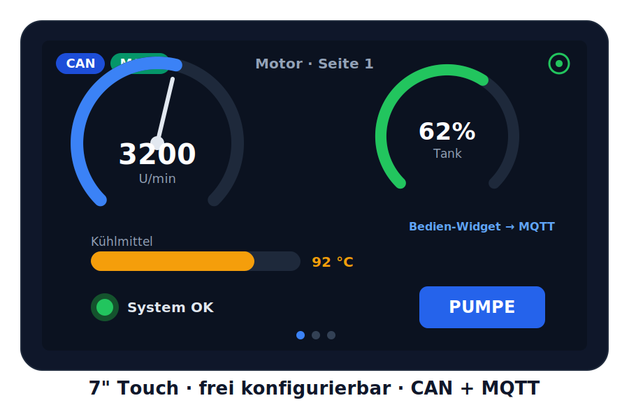
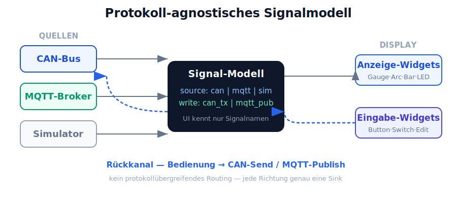
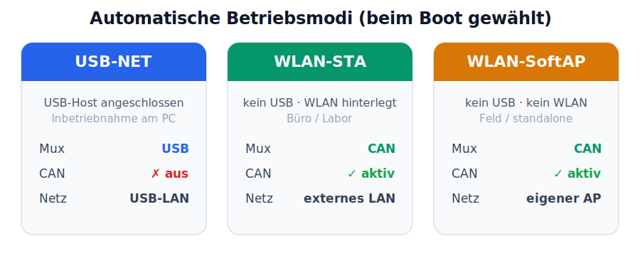

# ESP32-S3 Dashboard — Produktvorstellung

> Das **protokoll-agnostische, bidirektionale** Touch-Dashboard: CAN und MQTT
> auf einem 7″-Display, per JSON konfiguriert, drahtlos aktualisierbar — und
> **ohne eine Zeile Code**.

---

## Das Problem

Bus-Daten sichtbar und bedienbar zu machen, ist bislang ein Firmware-Projekt:
Toolchain aufsetzen, Anzeige in C programmieren, kompilieren, flashen — und das
bei jeder Änderung erneut. Kommt eine zweite Datenquelle wie MQTT hinzu, wird es
noch aufwändiger. Jedes neue Fahrzeug, jeder neue Prüfaufbau, jede geänderte
Signalzuordnung heißt: zurück zum Entwickler.

## Die Lösung

Das **ESP32-S3 Dashboard** trennt die Anzeige vollständig von der Firmware — und
macht aus einem reinen CAN-Anzeigegerät ein **universelles Dashboard**. Welche
Signale gelesen, wie sie dekodiert, wo sie angezeigt und wohin Bedienungen
gesendet werden, steht in einer lesbaren `dashboard.json` auf der SD-Karte. Die
Firmware bleibt unverändert; das Layout ändern Sie in Minuten, ohne
Entwicklungsumgebung.

---

## Protokoll-agnostisch: die UI kennt nur Signalnamen

Der Kerngedanke: **Ein Widget zeigt ein Signal — egal woher es kommt.** Ob ein
Wert per CAN-Frame oder per MQTT-Topic eintrifft, steht in der **Signaldefinition**,
nicht im Widget. Damit ist CAN einfach eine Quelle von mehreren, und dasselbe
Dashboard funktioniert am Fahrzeugbus wie im MQTT-Netzwerk.

Das Datenmodell ist bewusst einfach gehalten:

- **Lesen:** `source = can | mqtt | sim`
- **Schreiben:** `write = can_tx | mqtt_pub`
- **Kein protokollübergreifendes Routing** — jede Schreibrichtung hat genau eine
  Sink. Nur: CAN→Anzeige, MQTT→Anzeige, Bedienung→CAN-Send, Bedienung→MQTT-Publish.

## Bidirektional: Anzeigen und Bedienen

Neben den Anzeige-Widgets (Gauge, Arc, Chart, Bar, LED, Label) gibt es
**Eingabe-Widgets** — **Taster, Umschalter, Kontrollschalter und Zahlenfeld**.
Ein Tastendruck sendet einen CAN-Frame oder publiziert ein MQTT-Topic — je
nachdem, was in der Signaldefinition hinterlegt ist. So wird das Display vom
reinen Beobachter zum **Bedienpanel**. Ist ein Bus im aktuellen Betriebsmodus
nicht verfügbar, wird das Widget einfach **stale** — die bewährte Stale-Logik
greift unverändert.

## Autark: eigener Broker, eigenes Netz

Das Gerät braucht **keine externe Infrastruktur**. Es bringt einen
**schlanken MQTT-Broker** (MQTT 3.1.1, QoS 0/1) direkt auf dem Gerät mit und
spannt bei Bedarf sein **eigenes Netzwerk** auf. Kein externer Broker, kein
zwingender Router — ideal für den mobilen Einsatz am Prüfstand oder im Feld.

---

## Betriebsmodi: USB-first, automatisch gewählt

Ein hardwarebedingter Constraint des ESP32-S3 — **USB und CAN teilen sich
dieselben Pins** — wird zur klaren Betriebsart gemacht. Beim Einschalten wählt
das Gerät den Modus selbst:

- **USB-NET** — USB-Host angesteckt → Konfiguration direkt am PC, der
  deterministischste Weg zur Inbetriebnahme, ganz ohne WLAN-Suche.
- **WLAN-STA** — kein USB, hinterlegtes WLAN → verbindet sich ins vorhandene
  Netz; CAN und MQTT laufen gleichzeitig übers LAN.
- **WLAN-SoftAP** — kein USB, kein WLAN → **CAN-Display** mit eigenem
  Zugangspunkt; CAN hängt nie von einem externen AP ab.

**WLAN läuft mit CAN problemlos gleichzeitig** — nur USB kollidiert mit CAN. Der
Wunschmodus und die WLAN-Zugangsdaten werden dauerhaft im Gerät gespeichert; ein
Moduswechsel erfolgt sauber per Neustart.

---

## Die Bedienung: der visuelle Web-Editor

Konfiguriert wird nicht im Texteditor, sondern **grafisch**: Widgets per Maus
ziehen und an den Ecken skalieren, mit den Pfeiltasten pixelweise verschieben,
Farben per Farbwähler, Seiten per Doppelklick umbenennen. Ein
Vorschau-Schieberegler fährt alle Widgets von 0–100 % durch — so prüfen Sie
Warnschwellen und Farben, bevor überhaupt ein Bus angeschlossen ist.

Der Editor ist eine reine HTML/CSS/JS-Anwendung ohne Frameworks und ohne
Internet-Abhängigkeit. Er läuft **online am Gerät** oder **offline am PC**.

## Drahtlos aktualisieren — und sicher

Die fertige Konfiguration laden Sie über den Browser aufs Gerät. Bevor eine neue
Datei übernommen wird, **validiert** das Gerät sie vollständig — eindeutige
Signalnamen, gültige Byte-Bereiche, existierende Widget-Referenzen. Erst bei
fehlerfreier Prüfung wird die alte Konfiguration atomar ersetzt und das Gerät
startet neu. Fehlerhafte Uploads können den Betrieb nicht zerstören.

## Anzeige, die auf den Punkt informiert

- **9 Widget-Typen** — Gauge, Arc, Chart, Bar, LED, Label plus die Eingabe-Widgets
  Button, Switch und Zahlenfeld — frei auf einem 800×480-Raster platzierbar,
  verteilt auf bis zu 8 wischbare Seiten.
- **Stale-Erkennung** — bleibt ein Signal länger als sein Timeout aus, wird das
  Widget automatisch ausgegraut. Kein „eingefrorener" Wert täuscht Betrieb vor.
- **Warnschwellen** — pro Widget eine Grenze mit eigener Warnfarbe; kritische
  Zustände fallen sofort ins Auge.

## Flexible Dekodierung — und ein Simulator

Die Signal-Dekodierung ist voll flexibel: Byte-Offset und -Länge, Little-/
Big-Endian, vorzeichenbehaftete Ganzzahlen oder IEEE-754-Float, Skalierung,
Offset und physikalische Einheit. Ein integrierter **CAN-Simulator** erzeugt
synthetische Signalverläufe ganz ohne angeschlossenen Bus — perfekt für
Messe-Demos, Schulungen und die Editor-Entwicklung.

## Inbetriebnahme ohne PC

Ein **Settings-/Info-Screen** (Zahnrad-Icon, dessen Farbe den WLAN-Status zeigt)
fasst alles zusammen, was man bei der Inbetriebnahme braucht: WLAN/IP, Firmware-
und Geräteinfo, SD-Status — und einen **Live-CAN-RX-Monitor**, der empfangene
Frames pro CAN-ID mit Datenbytes und Rate anzeigt. So erkennen Sie direkt am
Gerät, ob und was auf dem Bus ankommt — ganz ohne seriellen Monitor.

## Robust gebaut

Kernlogik — Dekodierung, JSON-Parser, Broker-Protokoll, Editor-Logik — ist durch
**native Unit-Tests** auf dem PC abgesichert, unabhängig vom Board.
Speicherkritische Puffer sind bewusst ins PSRAM ausgelagert, damit Display,
Netzwerk und Bus zuverlässig zusammenspielen.

---

## Einsatzszenarien

- **Prüfstände & Labor** — schnell wechselnde Aufbauten, CAN und MQTT gemischt,
  ohne Firmware-Zyklus.
- **Maschinen- & Fahrzeugumbauten** — individuelle Cockpits und Bedienpanels,
  Retrofit-Displays.
- **IoT / Netzwerk** — autarkes Anzeige- und Bedienpanel mit eigenem Broker.
- **Prototyping** — vom ersten Signal zum bedienbaren Layout in einer Sitzung.
- **Service & Diagnose** — mobiles Mitlese- und Steuergerät für CAN und MQTT.

## Auf einen Blick

Grafisch, protokoll-agnostisch, bidirektional, autark — und ohne eine Zeile Code.
Das ESP32-S3 Dashboard bringt Bus- und Netzwerkdaten dorthin, wo man sie braucht,
macht sie **bedienbar** und lässt sie **jeder** anpassen, der eine JSON-Datei
hochladen kann.

---

> **Hinweis zum Reifegrad:** Das durchgängige CAN-Dashboard (Anzeige, Web-Editor,
> drahtloser Upload, Diagnose) ist verfügbar. Die MQTT-Datenquelle, der
> on-device-Broker, der Rückkanal mit Eingabe-Widgets und die automatischen
> Betriebsmodi sind das **Zielbild** und werden in drei Ausbaustufen umgesetzt
> (Transport/Betriebsmodi → MQTT-Lesen → Rückkanal).
